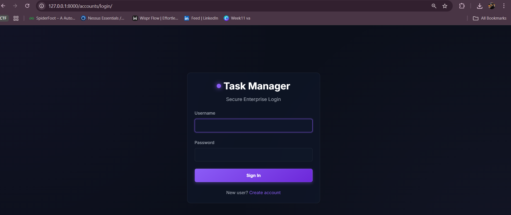
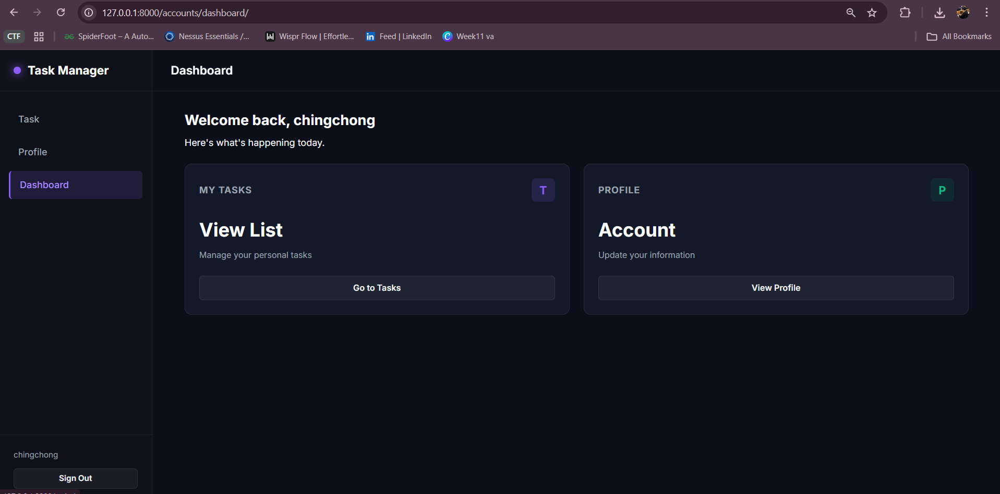
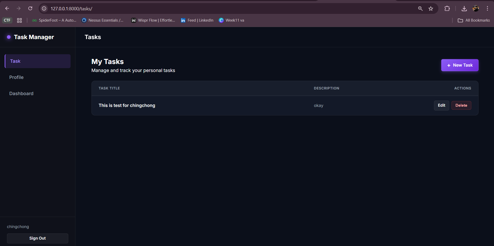
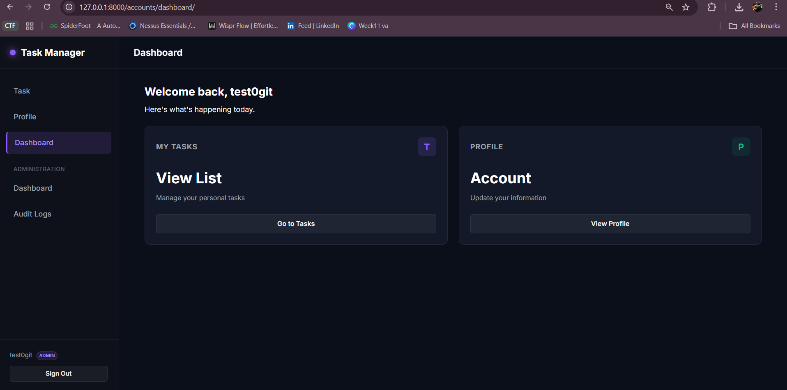
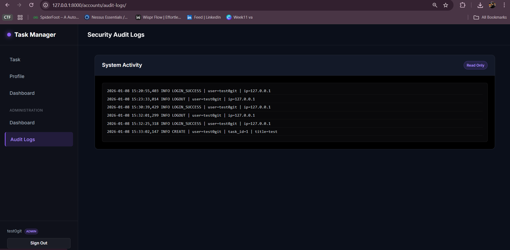

# Secure Task App (IKB21503)

## 1. Project Description

Secure Task App is a Django-based web application developed for the course
IKB21503 Secure Software Development. The system allows users to register,
authenticate, and manage personal tasks securely while enforcing Role-Based
Access Control (RBAC) between normal users and administrators.

The application is developed following secure coding best practices and
aligns with OWASP Top 10 and OWASP ASVS security requirements.

---

## 2. System Features

- User Registration & Login
- Role-Based Access Control (Admin / User)
- Secure Task CRUD (Create, Read, Update, Delete)
- User Profile Page
- Audit Log (Admin only)

---

## 3. Security Features Summary

- CSRF protection enabled for all forms
- Password hashing using Argon2
- Secure session management with HttpOnly and Secure cookies
- Server-side input validation using Django Forms
- ORM-based database access (SQL Injection prevention)
- IDOR prevention via ownership checks
- Custom error pages (400, 403, 404, 500)
- Sensitive configuration managed via environment variables
- Audit logging for important security-related events

---

## 4. Installation Steps (Using Virtual Environment)

### Step 1: Clone the project

git clone https://github.com/nuzas96/secure-task-app.git
cd secure_task_app

### Step 2: Create virtual environment

python -m venv venv

### Step 3: Activate virtual environment

venv\Scripts\activate

### Step 4: Install dependencies

pip install -r requirements.txt

## 5. Environment Configuration

Create a .env file based on .env.example.

## 6. Database Setup

python manage.py collectstatic
python manage.py migrate

### Create admin user

python manage.py createsuperuser

## 7. How to Run the Application

python manage.py runserver

## 8. Dependencies

Main dependencies used in this project:
Django
argon2-cffi
python-dotenv
whitenoise

## 9. Screenshots of System

- Login Page
  
- User Dashboard
  
- Task Management Page
  
- Admin Dashboard
  
- Admin Audit Log page
  
